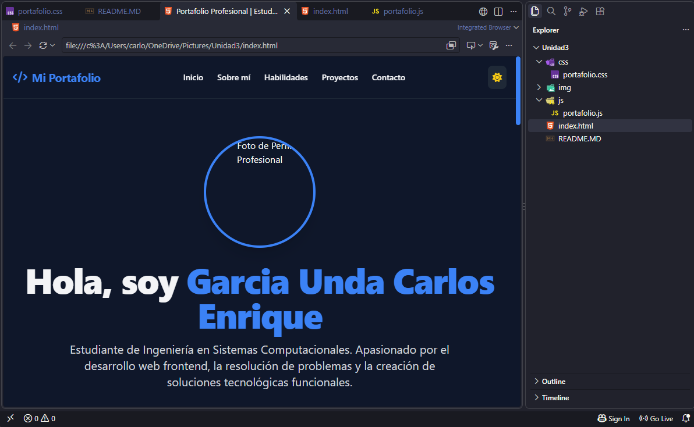

# Portafolio Web Profesional | Actividad 4

## 📌 Portada
* **Proyecto:** Portafolio Web Personal
* **Materia:** Desarrollo Web
* **Estudiante:** [Tu Nombre Completo]
* **Fecha de Entrega:** [Fecha]
* **Enlace GitHub Pages:** [Añadir URL de GitHub Pages aquí]

---

## 📝 Descripción del Proyecto
Este proyecto consiste en un portafolio web personal, responsivo e interactivo diseñado para presentar mis habilidades técnicas, perfil profesional y proyectos destacados.

* **Framework CSS utilizado:** Tailwind CSS (versión CDN).
* **Plantilla Base:** *Tailwind Starter Portfolio Template* adaptada de [ThemeWagon / Tailwind Toolbox](https://themewagon.com/).
* **Tecnologías Adicionales:** HTML5, CSS3 personalizado, JavaScript Vanilla nativo (ES6+) y FontAwesome 6.5.1.

### Menús y Secciones que componen el Portafolio:
1. **Navegación (Header):** Barra superior fija con logotipo, enlaces de salto interno suave, menú hamburguesa para dispositivos móviles y botón interactiv de modo oscuro/claro.
2. **Inicio (Hero):** Presentación principal con foto de perfil profesional real del estudiante, título, breve biografía y botones de llamada a la acción (CTA).
3. **Sobre Mí:** Resumen detallado sobre mi formación académica en Ingeniería en Sistemas, intereses de desarrollo y disponibilidad.
4. **Habilidades:** Tarjetas interactivas que destacan conocimientos en HTML5, CSS3, Tailwind CSS, JavaScript y control de versiones con Git/GitHub.
5. **Proyectos:** Galería interactiva con botones de filtrado (Todos, Web, Utilidades) y tarjetas con descripción de proyectos, tecnologías usadas y enlaces simulados a código/demo.
6. **Contacto:** Formulario funcional interactivo para recabar nombre, correo y mensaje con feedback dinámico mediante JavaScript.
7. **Pie de Página (Footer):** Derechos de autor, agradecimiento a la plantilla base y accesos directos a redes sociales.

---

## ⚙️ Proceso de Creación Paso a Paso

1. **Selección y Descarga de la Plantilla Base:**
   * Se eligió una plantilla minimalista construida sobre Tailwind CSS proveniente de ThemeWagon.

2. **Reestructuración e Integración del Repositorio:**
   * Se organizó el código en una estructura estándar de desarrollo web: `index.html` en la raíz, subcarpetas `/css`, `/js` e `/img`.
   * Se creó el archivo `css/portafolio.css` para manejar reglas personalizadas (transiciones, estilos de scrollbar) sin saturar la plantilla.
   * Se creó `js/portafolio.js` para dotar de interactividad nativa al proyecto.

3. **Inclusión de la Foto de Perfil Real:**
   * Se tomó una fotografía formal de perfil y se optimizó en formato JPG colocándola dentro de la carpeta `img/perfil.jpg`.

4. **Desarrollo de Funcionalidades en JavaScript:**
   * Se implementó la lógica del **Modo Oscuro** guardando la preferencia del usuario mediante `localStorage`.
   * Se programó el menú colapsable responsivo para celulares.
   * Se agregó el filtrado dinámico de proyectos mediante manipulaciones directas al DOM.
   * Se añadió la simulación de respuesta al enviar el formulario de contacto.

5. **Publicación en GitHub Pages:**
   * Se subió el código al repositorio público de GitHub y se activó el servicio de despliegue GitHub Pages desde las configuraciones del repositorio (`Settings` > `Pages`).

---

## 📸 Capturas de Pantalla

*(Inserta aquí las capturas de tu portafolio funcionando en tu navegador)*

### Vista Principal (Modo Oscuro / Claro)

